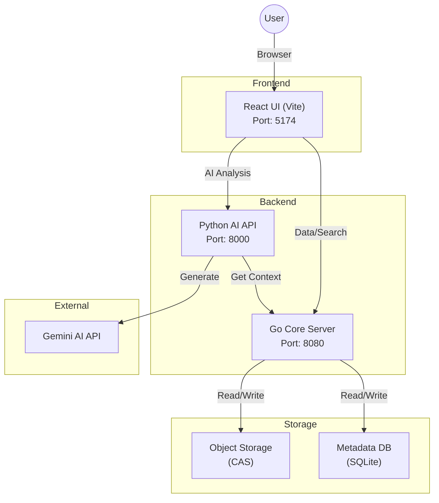

# MedBeads: 医療AIのためのイミュータブルでエージェントネイティブなデータ基盤

> **お知らせ:** `main` は v3 統合再構築中です（仕様: `specs/DESIGN_v3.md`）。
> 安定版 v2 は タグ `v2.2.0` またはブランチ `v2-maintenance` を参照してください。

MedBeads は、医療AIにおける「コンテキストの不整合（Context Mismatch）」を解決するために設計された **イミュータブル（不変）なエージェントネイティブ・データインフラストラクチャ** です。従来の可変なリレーショナルデータベースから **マークル有向非巡回グラフ（Merkle DAG）** へと医療記録を再構築することで、MedBeads は自律型エージェントに対して、明示的な因果関係、改ざん検知性、決定論的なコンテキスト取得機能を提供します。


**コンテキストの不整合（The Context Mismatch Problem）:**
現在の電子カルテ（EMR）やFHIR規格は人間の閲覧用に設計されており、暗黙的なコンテキストや確率的な検索（Vector RAGなど）に依存しているため、AIのハルシネーション（幻覚）を引き起こす原因となっています。MedBeads はこのパラダイムを転換します：
*   **確率的から決定論的へ:** コンテキストを推測するのではなく、AIエージェントは明示的な暗号学的リンクを辿ります。
*   **可変から不変へ:** すべての記録（"Bead"）はコンテンツアドレス指定され、変更不可能であり、監査可能性を保証します。
*   **冗長からトークン効率的へ:** 構造化されたグラフは、圧縮された「AIネイティブ言語」として機能します。

---

[English](README.md) | [日本語](README.ja.md) | [中文](README.zh.md)

## システムアーキテクチャ



### ディレクトリ構造

```
medbeads/
├── core/                    # Go バックエンドサーバー
│   ├── main.go              # エントリーポイント
│   ├── medbeads_data/       # データ保存領域 (Dockerではマウント)
│   └── Dockerfile           # Core用 Dockerfile
│
├── api/                     # Python AI APIサーバー
│   ├── main.py              # FastAPIエントリーポイント
│   ├── ai.py                # Gemini AI連携ロジック
│   └── Dockerfile           # API用 Dockerfile
│
├── ui/                      # React フロントエンド
│   ├── src/                 # ソースコード
│   └── Dockerfile           # UI用 Dockerfile
│
├── FHIR_sample/             # サンプルデータ (Synthea由来)
├── docker-compose.yml       # Docker構成ファイル
└── start.sh                 # ローカル開発用起動スクリプト
```

## 設定 (Configuration)

AI機能を利用するには、Google Gemini APIキーの設定が必要です。

1. サンプルの環境変数ファイルをコピーします:
   ```bash
   cp api/.env.example api/.env
   ```
2. `api/.env` を編集し、取得したAPIキーを設定してください:
   ```
   GEMINI_API_KEY=your_actual_api_key_here
   ```

## クイックスタート (Docker)

MedBeads を最も簡単に実行する方法は Docker を使用することです。これにより、Core、API、UI の各サービスが起動します。

### 前提条件
- Docker Engine
- Docker Compose

### アプリケーションの実行

1. コンテナのビルドと起動:
   ```bash
   docker-compose up --build
   ```

2. **ブラウザでUIにアクセス:**
   
   👉 **http://localhost:5174**

3. 全サービス一覧:
   - **UI (Visualizer):** [http://localhost:5174](http://localhost:5174)
   - **AI API:** [http://localhost:8000](http://localhost:8000)
   - **Core Engine:** [http://localhost:8080](http://localhost:8080)

4. アプリケーションの停止:
   ```bash
   Ctrl+C
   ```

### プリロード済みサンプルデータ

このリポジトリには、すぐにデモできるように **3名のサンプル患者** が含まれています。FHIRサンプルから追加の患者を取り込むには、Docker起動中に以下のコマンドを実行してください:

```bash
# 追加の患者を取り込み（例: 5名追加）
uv run --with requests scripts/mass_ingest.py FHIR_sample --limit 5
```

## ローカル開発 (手動実行)

Docker を使用せずに個別にサービスを実行したい場合は、以下の手順に従ってください。

### 前提条件
- Go 1.21+
- Python 3.12+ (`uv` で管理)
- Node.js 20+

### ワンクリック・スタート（推奨）
ヘルパースクリプトを使用して、環境確認、サンプルデータの取り込み、全サーバーの起動を一括で行うことができます:
```bash
./start.sh
```

### 手動手順 (詳細)

1. **Core Engine (Go) の起動:**
   データの保存とインデックスを管理するサービスです。
   ```bash
   cd core
   go run main.go
   # Server runs on localhost:8080
   ```

2. **初期データの取り込み (Python):**
   *(データベースが空の場合に必須)*
   FHIR サンプルのデータを Beads に変換し、Core Engine に送信します。
   Core が起動している状態で、**新しいターミナル**を開いて実行してください:
   ```bash
   # 5件のサンプル患者データを取り込み
   uv run --with requests scripts/mass_ingest.py medbeads/FHIR_sample --limit 5
   ```

3. **Start AI API (Python):**
   AI分析機能を提供するサービスです。
   ```bash
   cd api
   uv run uvicorn main:app --host 0.0.0.0 --port 8000
   ```

4. **Start UI (React):**
   フロントエンドの可視化インターフェースです。
   ```bash
   cd ui
   npm install
   npm run dev
   # Access at http://localhost:5174
   ```

## データアーキテクチャと取り込みフロー

1. **FHIR ソースデータ**
   - `medbeads/FHIR_sample/`（一般サンプル）または `sample_data/fhir/`（セキュリティクリアランステストデータ）に配置されています。
   - 生の FHIR JSON ファイルが含まれます。

2. **取り込みプロセス (Python)**
   - `python scripts/mass_ingest.py` (または `uv run`) を実行します。
   - スクリプトは JSON ファイルを読み込み、**Beads** (マークルグラフノード) に変換して Core Server の API 経由で送信します。
   - **重要:** Beads は SQLite にインデックス登録されるために、必ず API 経由で取り込む必要があります。オブジェクトファイルを単にコピーしただけではデータベースに登録されません。

3. **ストレージ (Core Engine)**
   - **Content Addressable Storage (CAS):** 生データは `medbeads/core/medbeads_data/objects/` に不変ファイルとして保存されます。
   - **Metadata Index (SQLite):** 検索可能なインデックスが `medbeads/core/medbeads_data/metadata.db` に保存されます。

4. **Docker 起動時の取り込み**
   - Docker（`deploy/hf/Dockerfile`）で実行する場合、スタートアップスクリプトが自動的に以下を実行します：
     1. Core サーバーを一時的に起動
     2. `mass_ingest.py` を使用して `sample_data/fhir/` から FHIR データを取り込み
     3. セキュリティクリアランスルールを設定
     4. supervisord でサービスを再起動

## セキュリティクリアランス

MedBeads は、特定の医療記録を誰が閲覧できるかを制御する **セキュリティクリアランス** をサポートしています。**ブラックリストモデル**（デフォルト：全員閲覧可、特定のロールを明示的に拒否）を採用しています。

### 閲覧者ロール

| ロール | ラベル（英語） | 説明 |
|--------|---------------|------|
| `patient` | Patient | 患者本人 |
| `family` | Family | 家族 |
| `primary_care` | Primary Care | 主治医 |
| `specialist` | Specialist | 専門医 |
| `nurse` | Nurse | 看護師 |
| `insurance` | Insurance | 保険会社 |
| `researcher` | Researcher | 研究者 |
| `emergency` | Emergency | 緊急時オーバーライド（全制限を無視） |
| `system` | System | システム/AI（フルアクセス） |

### サンプルテスト患者

`sample_data/fhir/` ディレクトリには、さまざまなクリアランスシナリオを持つ5名のテスト患者が含まれています：

| 患者 | シナリオ | クリアランス |
|------|----------|-------------|
| 患者A (30代女性) | 婦人科受診 | 家族から隠す |
| 患者B (50代男性) | がん疑い | 患者・家族から一時的に隠す（2週間） |
| 患者C (40代男性) | 精神科通院 | 保険会社から隠す |
| 患者D (60代女性) | 一般内科 | 制限なし |
| 患者E (20代男性) | 複合/緊急 | 複数の制限（薬物検査、アルコール） |

### クリアランスのテスト

UIヘッダーの **Viewer Role セレクター** を使用してロールを切り替え、制限された記録がどのように表示または非表示になるかを確認できます。

## シードデータ（初期データ）の投入

リポジトリに初期シードデータ（例：サンプルの半分）を投入してコミットしたい場合の手順:

1. Core Server を起動:
   ```bash
   cd core && go run main.go
   ```
2. 取り込みスクリプトを実行 (別ターミナル):
   ```bash
   uv run --with requests medbeads/scripts/mass_ingest.py medbeads/FHIR_sample --limit 5
   ```
3. (任意) 生成されたデータを強制的にコミット:
   ```bash
   git add -f core/medbeads_data/metadata.db core/medbeads_data/objects/
   ```

## 📚 Citation（引用）

本プロジェクトを研究で使用される場合は、以下の論文を引用してください:

```bibtex
@article{medbeads2025,
  title={MedBeads: Immutable Agent-Native Data Infrastructure for Medical AI},
  author={Nakajima, Takahito},
  journal={medRxiv (査読中)},
  year={2026},
  note={DOI: TBD}
}
```

## 🙏 Acknowledgement（謝辞）

本プロジェクトで使用している合成FHIRデータを提供してくださった [Synthea](https://synthetichealth.github.io/synthea/) に感謝いたします。