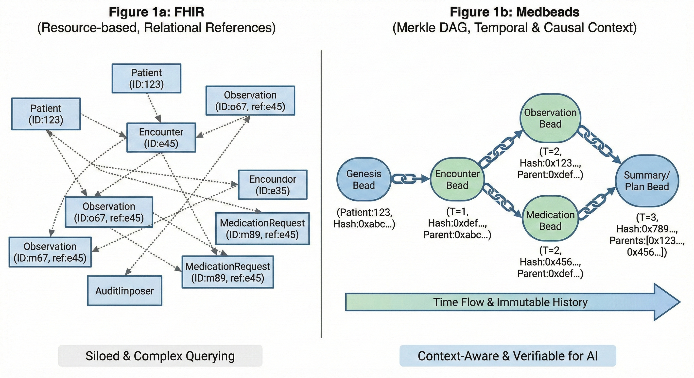
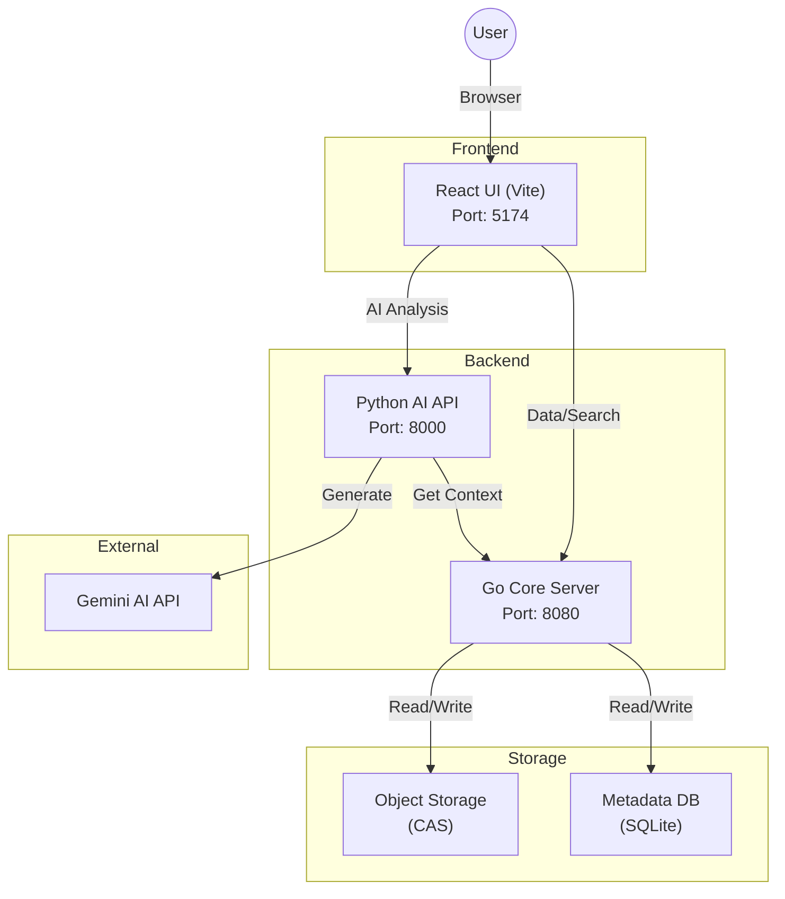

# MedBeads: An Agent-Native, Immutable Data Substrate for Trustworthy Medical AI

> **Notice:** `main` is undergoing the v3 unification rebuild (spec: `specs/DESIGN_v3.md`).
> For the stable v2 release, see tag `v2.2.0` or branch `v2-maintenance`.

## v3 Quickstart

The v3 core is a single Go binary, `medbeadsd` (engine + MCP server + REST API).
Requirements: Go 1.25+, a C compiler (CGO), and [uv](https://docs.astral.sh/uv/) for the
sample-data ingest. The sections below this Quickstart describe **v2** and will be
rewritten when v3 lands; the commands here are the current way to run `main`.

```bash
# 1. Build (the sqlite_fts5 tag and CGO are required)
CGO_ENABLED=1 go build -tags sqlite_fts5 -o medbeadsd ./cmd/medbeadsd

# 2. Ingest the bundled 10 synthetic Synthea patients (via MCP, ~30s)
cd bench && uv run python -m bench.ingest \
  --fhir-dir ../FHIR_sample --data-dir ../demo_data --medbeadsd ../medbeadsd
cd ..

# 3. Start the daemon: REST at / and MCP at /mcp on the same port
./medbeadsd serve -data ./demo_data -role viewer -http 127.0.0.1:8080

# 4. Try it
curl http://127.0.0.1:8080/patients          # REST (frozen v2 contract, feeds the UI)
./medbeadsd verify -data ./demo_data          # cryptographic integrity check
./medbeadsd reindex -data ./demo_data         # rebuild index.db from Pods alone
```

For the React UI: `cd ui && cp .env.example .env && npm ci && npm run dev`
(the `.env` sets `VITE_API_BASE_URL=http://localhost:8080`; the Python AI API
referenced in `.env.example` is retired in v3 and can be ignored).

For MCP clients (Claude Desktop / Claude Code), use stdio mode instead:
`medbeadsd serve -data ./demo_data -role viewer` — add `-role system` to enable
the write tools (`create_bead`, `apc_trigger`).

MedBeads is an **Immutable, Agent-Native Data Infrastructure** designed to address the "Context Mismatch" in medical AI. By restructuring medical records from mutable relational databases into a **Merkle Directed Acyclic Graph (DAG)**, MedBeads provides explicit causal linking, tamper-evidence, and deterministic context retrieval for autonomous agents.



**The Context Mismatch Problem:**
Current Electronic Medical Records (EMRs) and FHIR standards are designed for human review, relying on implicit context and probabilistic search (like Vector RAG) which can lead to AI hallucinations. MedBeads shifts this paradigm:
*   **From Probabilistic to Deterministic:** Instead of guessing context, AI agents traverse explicit cryptographic links.
*   **From Mutable to Immutable:** Every record ("Bead") is content-addressed and unchangeable, guaranteeing auditability.
*   **From Verbose to Token-Efficient:** The structured graph serves as a compressed "AI-native language."

---

[English](README.md) | [日本語](README.ja.md)

## System Architecture



### Directory Structure

```
medbeads/
├── core/                    # Go Backend Server
│   ├── main.go              # Entry Point
│   ├── medbeads_data/       # Data Storage (Mounted in Docker)
│   └── Dockerfile           # Core Dockerfile
│
├── api/                     # Python AI API Server
│   ├── main.py              # FastAPI Entry Point
│   ├── ai.py                # Gemini AI Logic
│   └── Dockerfile           # API Dockerfile
│
├── ui/                      # React Frontend
│   ├── src/                 # Source Code
│   └── Dockerfile           # UI Dockerfile
│
├── FHIR_sample/             # Sample Data (Synthea)
├── docker-compose.yml       # Docker Composition
└── start.sh                 # Local Helper Script
```

## Configuration

To use AI features, you need to configure your Google Gemini API Key.

1. Copy the example environment file:
   ```bash
   cp api/.env.example api/.env
   ```
2. Edit `api/.env` and set your API key:
   ```
   GEMINI_API_KEY=your_actual_api_key_here
   ```

## Quick Start (Docker)

The easiest way to run MedBeads is using Docker. This will start the Core, API, and UI services.

### Prerequisites
- Docker Engine
- Docker Compose

### Running the Application

1. Build and start the containers:
   ```bash
   docker-compose up --build
   ```

2. **Open your browser and access the UI:**
   
   👉 **http://localhost:5174**

3. All services:
   - **UI (Visualizer):** [http://localhost:5174](http://localhost:5174)
   - **AI API:** [http://localhost:8000](http://localhost:8000)
   - **Core Engine:** [http://localhost:8080](http://localhost:8080)

4. Stop the application:
   ```bash
   Ctrl+C
   ```

### Pre-loaded Sample Data

The repository includes **3 sample patients** for immediate demo. To add more patients from the FHIR samples, run the following command while Docker is running:

```bash
# Add more patients (e.g., 5 additional)
uv run --with requests scripts/mass_ingest.py FHIR_sample --limit 5
```

## Local Development (Manual)

If you prefer to run services individually without Docker, follow these steps.
Since the repository does not contain pre-generated data, **Step 2 (Data Ingestion)** is required for the first run.

### Prerequisites
- Go 1.21+
- Python 3.12+ (managed via `uv`)
- Node.js 20+

### One-Click Start
You can use the helper script to verify the environment, ingest sample data, and start all servers at once:
```bash
./start.sh
```

### Manual Steps (Detailed)

1. **Start Core Engine (Go):**
   This service manages the data storage and index.
   ```bash
   cd core
   go run main.go
   # Server runs on localhost:8080
   ```

2. **Ingest Initial Data (Python):**
   *(Required if database is empty)*
   Convert FHIR sample data into Beads and send to the Core Engine.
   Run this in a **new terminal** while Core is running:
   ```bash
   # Ingest 5 sample patients
   uv run --with requests scripts/mass_ingest.py medbeads/FHIR_sample --limit 5
   ```

3. **Start AI API (Python):**
   This service provides AI analysis features.
   ```bash
   cd api
   uv run uvicorn main:app --host 0.0.0.0 --port 8000
   ```

4. **Start UI (React):**
   The frontend visualization interface.
   ```bash
   cd ui
   npm install
   npm run dev
   # Access at http://localhost:5174
   ```

## Data Architecture & Ingestion Flow

1. **FHIR Source Data**
   - Located in `medbeads/FHIR_sample/` (general samples) or `sample_data/fhir/` (security clearance test data).
   - Contains raw FHIR JSON files.

2. **Ingestion Process (Python)**
   - Run `python scripts/mass_ingest.py` (or via `uv run`).
   - The script reads JSON files, converts them into **Beads** (Merkle Graph Nodes), and sends them to the Core Server via API.
   - **Important:** Beads must be ingested through the API to be indexed in SQLite. Simply copying object files will not register them in the database.

3. **Storage (Core Engine)**
   - **Content Addressable Storage (CAS):** Raw data is stored as immutable files in `medbeads/core/medbeads_data/objects/`.
   - **Metadata Index (SQLite):** Searchable index is stored in `medbeads/core/medbeads_data/metadata.db`.

4. **Docker Startup Ingestion**
   - When running via Docker (`deploy/hf/Dockerfile`), the startup script automatically:
     1. Starts the Core server temporarily
     2. Ingests FHIR data from `sample_data/fhir/` using `mass_ingest.py`
     3. Sets up security clearance rules
     4. Restarts services via supervisord

## Security Clearance

MedBeads supports **Security Clearance** to control who can view specific medical records. This uses a **Blacklist model** (default: all can view, explicit deny for specific roles).

### Viewer Roles

| Role | Label (日本語) | Description |
|------|---------------|-------------|
| `patient` | 患者本人 | The patient themselves |
| `family` | 家族 | Family members |
| `primary_care` | 主治医 | Primary care physician |
| `specialist` | 専門医 | Consulting specialists |
| `nurse` | 看護師 | Nursing staff |
| `insurance` | 保険会社 | Insurance companies |
| `researcher` | 研究者 | Research access |
| `emergency` | 緊急時 | Emergency override (bypasses all restrictions) |
| `system` | システム | System/AI processes (full access) |

### Sample Test Patients

The `sample_data/fhir/` directory contains 5 test patients with various clearance scenarios:

| Patient | Scenario | Clearance |
|---------|----------|-----------|
| Patient A (30s F) | Gynecology | Hide from family |
| Patient B (50s M) | Cancer suspicion | Temporarily hide from patient/family (2 weeks) |
| Patient C (40s M) | Psychiatry | Hide from insurance |
| Patient D (60s F) | General internal medicine | No restrictions |
| Patient E (20s M) | Complex/Emergency | Multiple restrictions (drug screen, alcohol) |

### Testing Clearance

Use the **Viewer Role Selector** in the UI header to switch between roles and observe how restricted records are displayed or hidden.

## Populating Seed Data

To populate the repository with initial seed data (e.g., half of the samples):

1. Start the Core Server:
   ```bash
   cd core && go run main.go
   ```
2. Run the ingestion script (in another terminal):
   ```bash
   uv run --with requests medbeads/scripts/mass_ingest.py medbeads/FHIR_sample --limit 5
   ```
3. (Optional) Force commit the generated data:
   ```bash
   git add -f core/medbeads_data/metadata.db core/medbeads_data/objects/
   ```

## 📚 Citation

If you use MedBeads in your research, please cite our paper
([arXiv:2602.01086](https://arxiv.org/abs/2602.01086)):

```bibtex
@article{nakajima2026medbeads,
  title={MedBeads: An Agent-Native, Immutable Data Substrate for Trustworthy Medical AI},
  author={Nakajima, Takahito},
  journal={arXiv preprint arXiv:2602.01086},
  year={2026},
  doi={10.48550/arXiv.2602.01086},
  url={https://arxiv.org/abs/2602.01086}
}
```

A `CITATION.cff` is provided so GitHub's "Cite this repository" button stays in sync.

## 📄 License

Licensed under the [Apache License 2.0](LICENSE). See [`NOTICE`](NOTICE) for attribution.
All patient data is synthetic (generated by Synthea); no real PHI is present in this
repository, its history, or its tests.

## 🙏 Acknowledgement

We thank [Synthea](https://synthetichealth.github.io/synthea/) for providing the synthetic FHIR patient data used in this project.