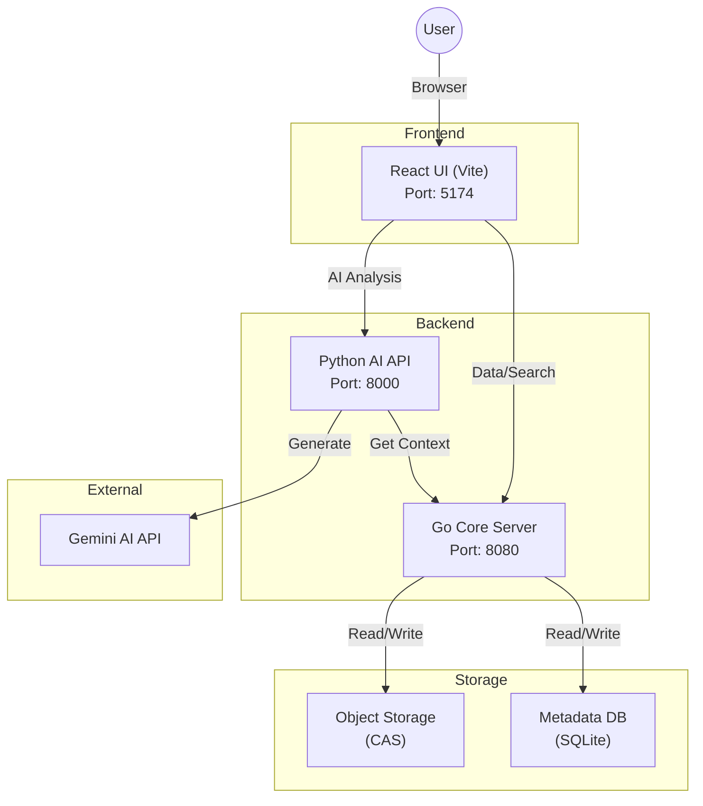

# MedBeads: 医疗 AI 的原生代理 (Agent-Native)、不可变数据基石

MedBeads 是一个 **不可变 (Immutable)、原生代理 (Agent-Native) 数据基础设施**，旨在解决医疗 AI 中的“上下文不匹配 (Context Mismatch)”问题。通过将医疗记录从可变的关系数据库重构为 **Merkle 有向无环图 (DAG)**，MedBeads 为自主代理提供了明确的因果链接、防篡改证据和确定性的上下文检索。


**上下文不匹配问题 (The Context Mismatch Problem):**
当前的电子病历 (EMR) 和 FHIR 标准是为人类审查设计的，依赖于隐式上下文和概率搜索（如 Vector RAG），这可能导致 AI 产生幻觉。MedBeads 改变了这一范式：
*   **从概率到确定:** AI 代理不再猜测上下文，而是遍历明确的加密链接。
*   **从可变到不可变:** 每条记录 (“Bead”) 都是内容寻址且不可更改的，保证了可审计性。
*   **从冗余到 Token 高效:** 结构化图表作为一种压缩的“AI 原生语言”发挥作用。

---

[English](README.md) | [日本語](README.ja.md) | [中文](README.zh.md)

## 系统架构



### 目录结构

```
medbeads/
├── core/                    # Go 后端服务器
│   ├── main.go              # 入口点
│   ├── medbeads_data/       # 数据存储 (Docker 中挂载)
│   └── Dockerfile           # Core Dockerfile
│
├── api/                     # Python AI API 服务器
│   ├── main.py              # FastAPI 入口点
│   ├── ai.py                # Gemini AI 逻辑
│   └── Dockerfile           # API Dockerfile
│
├── ui/                      # React 前端
│   ├── src/                 # 源代码
│   └── Dockerfile           # UI Dockerfile
│
├── FHIR_sample/             # 样本数据 (Synthea)
├── docker-compose.yml       # Docker 配置文件
└── start.sh                 # 本地辅助启动脚本
```

## 配置 (Configuration)

要使用 AI 功能，您需要配置 Google Gemini API 密钥。

1. 复制示例环境变量文件:
   ```bash
   cp api/.env.example api/.env
   ```
2. 编辑 `api/.env` 并设置您的 API 密钥:
   ```
   GEMINI_API_KEY=your_actual_api_key_here
   ```

## 快速开始 (Docker)

运行 MedBeads 最简单的方法是使用 Docker。这将同时启动 Core、API 和 UI 服务。

### 前置条件
- Docker Engine
- Docker Compose

### 运行应用程序

1. 构建并启动容器:
   ```bash
   docker-compose up --build
   ```

2. **在浏览器中访问 UI:**
   
   👉 **http://localhost:5174**

3. 所有服务:
   - **UI (可视化):** [http://localhost:5174](http://localhost:5174)
   - **AI API:** [http://localhost:8000](http://localhost:8000)
   - **Core Engine (核心):** [http://localhost:8080](http://localhost:8080)

4. 停止应用程序:
   ```bash
   Ctrl+C
   ```

### 预加载的样本数据

此仓库包含 **3 个样本患者**，可以立即进行演示。要从 FHIR 样本中添加更多患者，请在 Docker 运行时执行以下命令:

```bash
# 添加更多患者（例如: 5 个额外）
uv run --with requests scripts/mass_ingest.py FHIR_sample --limit 5
```

## 本地开发 (手动)

如果您不想使用 Docker 而更喜欢单独运行服务，请按照以下步骤操作。

### 前置条件
- Go 1.21+
- Python 3.12+ (通过 `uv` 管理)
- Node.js 20+

### 一键启动 (推荐)
您可以使用辅助脚本来验证环境、摄入样本数据并一次性启动所有服务器:
```bash
./start.sh
```

### 手动步骤 (详细)

1. **启动 Core Engine (Go):**
   该服务负责管理数据存储和索引。
   ```bash
   cd core
   go run main.go
   # Server runs on localhost:8080
   ```

2. **摄入初始数据 (Python):**
   *(如果数据库为空，则必须执行此步骤)*
   将 FHIR 样本数据转换为 Beads 并发送到 Core Engine。
   请在 Core 运行时打开一个 **新终端** 执行:
   ```bash
   # 摄入 5 个样本患者数据
   uv run --with requests scripts/mass_ingest.py medbeads/FHIR_sample --limit 5
   ```

3. **启动 AI API (Python):**
   该服务提供 AI 分析功能。
   ```bash
   cd api
   uv run uvicorn main:app --host 0.0.0.0 --port 8000
   ```

4. **启动 UI (React):**
   前端可视化界面。
   ```bash
   cd ui
   npm install
   npm run dev
   # Access at http://localhost:5174
   ```

## 数据架构与摄入流程

1. **FHIR 源数据**
   - 位于 `medbeads/FHIR_sample/`（通用样本）或 `sample_data/fhir/`（安全许可测试数据）。
   - 包含原始 FHIR JSON 文件。

2. **摄入流程 (Python)**
   - 运行 `python scripts/mass_ingest.py` (或通过 `uv run`)。
   - 脚本读取 JSON 文件，将其转换为 **Beads** (Merkle Graph Nodes)，并通过 API 发送到 Core Server。
   - **重要:** Beads 必须通过 API 摄入才能在 SQLite 中建立索引。仅复制对象文件不会将其注册到数据库中。

3. **存储 (Core Engine)**
   - **内容寻址存储 (CAS):** 原始数据作为不可变文件存储在 `medbeads/core/medbeads_data/objects/` 中。
   - **元数据索引 (SQLite):** 可搜索索引存储在 `medbeads/core/medbeads_data/metadata.db` 中。

4. **Docker 启动时摄入**
   - 通过 Docker（`deploy/hf/Dockerfile`）运行时，启动脚本会自动执行：
     1. 临时启动 Core 服务器
     2. 使用 `mass_ingest.py` 从 `sample_data/fhir/` 摄入 FHIR 数据
     3. 设置安全许可规则
     4. 通过 supervisord 重启服务

## 安全许可 (Security Clearance)

MedBeads 支持 **安全许可**，用于控制谁可以查看特定的医疗记录。采用 **黑名单模式**（默认：所有人可查看，明确拒绝特定角色）。

### 查看者角色

| 角色 | 标签（英文） | 说明 |
|------|-------------|------|
| `patient` | Patient | 患者本人 |
| `family` | Family | 家属 |
| `primary_care` | Primary Care | 主治医生 |
| `specialist` | Specialist | 专科医生 |
| `nurse` | Nurse | 护士 |
| `insurance` | Insurance | 保险公司 |
| `researcher` | Researcher | 研究人员 |
| `emergency` | Emergency | 紧急覆盖（绕过所有限制） |
| `system` | System | 系统/AI（完全访问） |

### 样本测试患者

`sample_data/fhir/` 目录包含5名具有不同许可场景的测试患者：

| 患者 | 场景 | 许可 |
|------|------|------|
| 患者A (30多岁女性) | 妇科就诊 | 对家属隐藏 |
| 患者B (50多岁男性) | 癌症疑似 | 暂时对患者/家属隐藏（2周） |
| 患者C (40多岁男性) | 精神科就诊 | 对保险公司隐藏 |
| 患者D (60多岁女性) | 普通内科 | 无限制 |
| 患者E (20多岁男性) | 复杂/急诊 | 多重限制（药物筛查、酒精） |

### 测试许可

使用 UI 头部的 **Viewer Role 选择器** 切换角色，观察受限记录如何显示或隐藏。

## 填充种子数据

如果需要向仓库填充初始种子数据 (例如: 一半的样本) 并提交:

1. 启动 Core Server:
   ```bash
   cd core && go run main.go
   ```
2. 运行摄入脚本 (在另一个终端):
   ```bash
   uv run --with requests medbeads/scripts/mass_ingest.py medbeads/FHIR_sample --limit 5
   ```
3. (可选) 强制提交生成的数据:
   ```bash
   git add -f core/medbeads_data/metadata.db core/medbeads_data/objects/
   ```

## 📚 Citation（引用）

如果您在研究中使用 MedBeads，请引用我们的论文：

```bibtex
@article{medbeads2025,
  title={MedBeads: Immutable Agent-Native Data Infrastructure for Medical AI},
  author={Nakajima, Takahito},
  journal={medRxiv (审稿中)},
  year={2026},
  note={DOI: TBD}
}
```

## 🙏 Acknowledgement（致谢）

感谢 [Synthea](https://synthetichealth.github.io/synthea/) 提供本项目使用的合成 FHIR 患者数据。